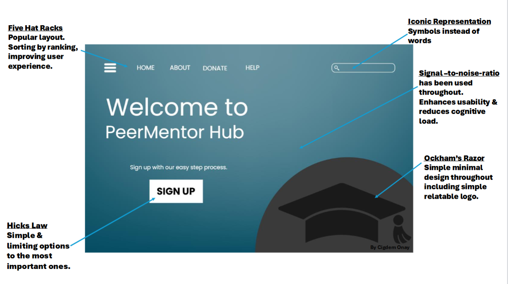
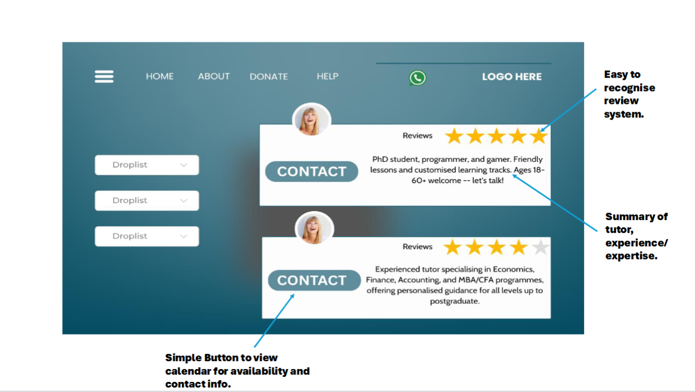
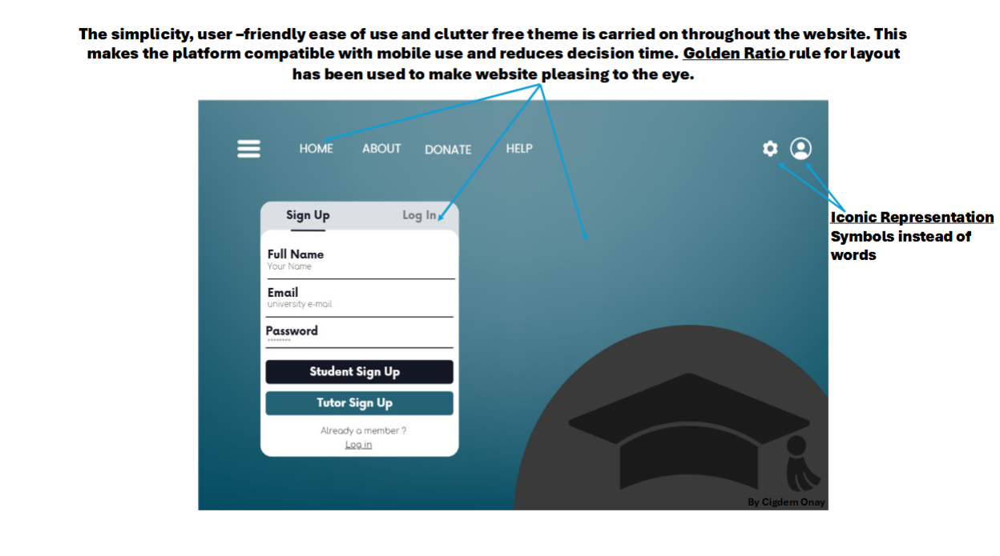
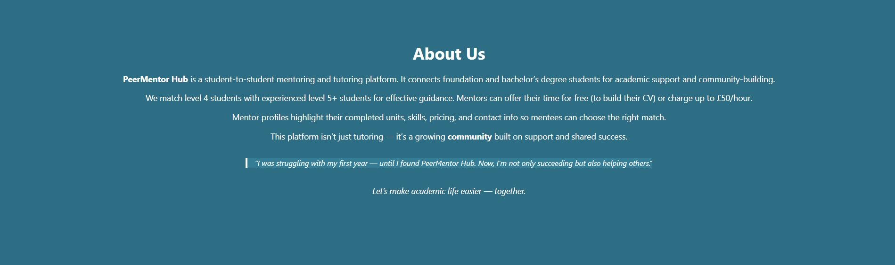
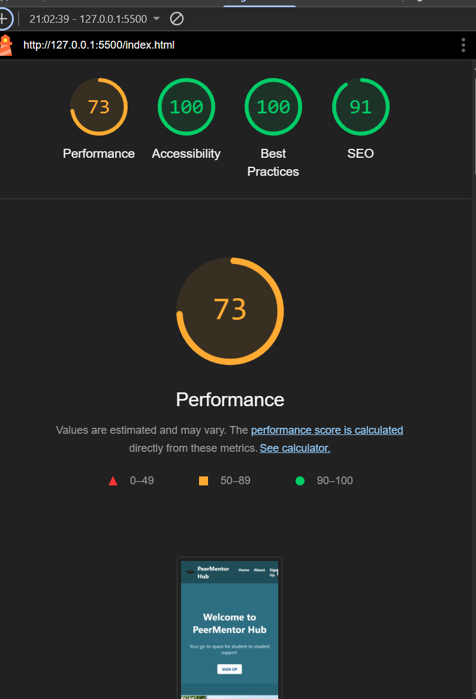

Peer Mentor Hub

Peer Mentor Hub is a responsive tutoring/mentoring website built for university students from various study pathways. It connects foundation-level students with more experienced peers who can support their academic journey either voluntarily or for a small fee. This creates free and affordable support, income and a community.

What the project does

This project provides a digital platform for peer-to-peer academic support:

Mentees - to find experienced mentors.
Mentors - to offer tutoring services, either for free or paid.
Minimalist navigation between Home, About, and Sign-Up sections.
Responsive layout and accessibility across devices.

User Value and Stories

Emma: a second-year student, uses the platform to earn extra income tutoring first-years in Environmental Science.
John: a foundation-level student with autism, appreciates the clear layout and easily navigable sign-up form.

Users can build their CVs, improve understanding of topics, and join a student-driven community.


Development Process

Wireframes

Wireframes were created in Canva and revised based on tutor feedback:

Improved clarity of how user needs were met.
Enhanced alignment with personas

  
  


Final Website Screenshots

  
  


Project Set Up & Running Instructions
1. Clone the repository:

 ```bash
git clone https://github.com/chionay/mentoring_website.git

2. Navigate to project folder 

cd mentoring website

3.open the project on visual code or similar code editor.

4. Run the project locally.

TESTING & VALIDATION 

Manual Testing passed on the following features successfully:
* Navigation bar links Home, About and Sign Up
*Sign Up but scrolls to sighn up form
* Site is responsive and adopts to mobile, tablet and desktop screen
*Logo and navigation clearly visible and aligned.
* The back to top button appears and scrolls up.
*Input fiels accept text email and number and dropdown values.
*No layout issues on resizing browser

BUGS & FIXES

* Image overlay and wrong size which was the longest to fix.
* Sign up button wrong size misaligned 
* Readme file was not showing on git and not pushing on vs had to copy and paste directly to git hub which i found out too late.
* Getting image half down onto home page and alligning text and sign up to top of page. Lots of error but fixed using object-fit

Known Issues
Form submission dos not save e-mail-reserved for future function
No backend validation or log in system imlemended 

Validation with Autamated tools All successful

HTML Validation** using [W3C Markup Validator](https://validator.w3.org/)
CSS Validation** using [W3C CSS Validator](https://jigsaw.w3.org/css-validator
Lighthouse Test** in Chrome DevTools used to check accessibility and performance




