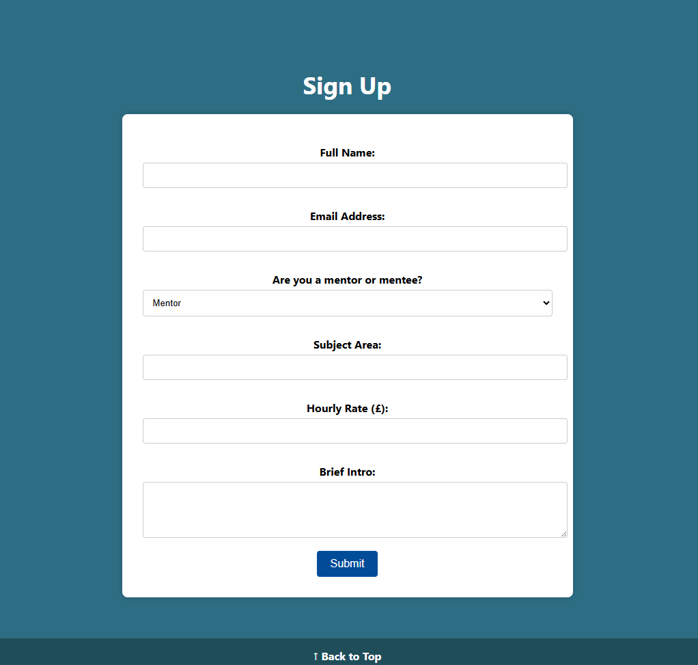

Peer Mentor Hub

Peer Mentor Hub is a responsive tutoring/mentoring website built for university students from various study pathways. It connects foundation-level students with more experienced peers who can support their academic journey either voluntarily or for a small fee. This creates free and affordable support, income and a community.

What the project does

This project provides a digital platform for peer-to-peer academic support:

Mentees - to find experienced mentors.
Mentors - to offer tutoring services, either for free or paid.
Minimalist navigation between Home, About, and Sign-Up sections.
Responsive layout and accessibility across devices.

User Value and Stories

Emma: a second-year student, uses the platform to earn extra income tutoring first-years in Environmental Science.
John: a foundation-level student with autism, appreciates the clear layout and easily navigable sign-up form.

Users can build their CVs, improve understanding of topics, and join a student-driven community.

Development Process

Wireframes

Wireframes were created in Canva and revised based on tutor feedback:

Improved clarity of how user needs were met.
Enhanced alignment with personas

  
  

Final Website Screenshots

  
  

